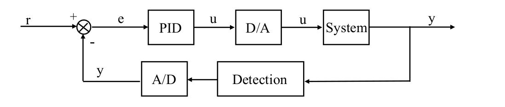
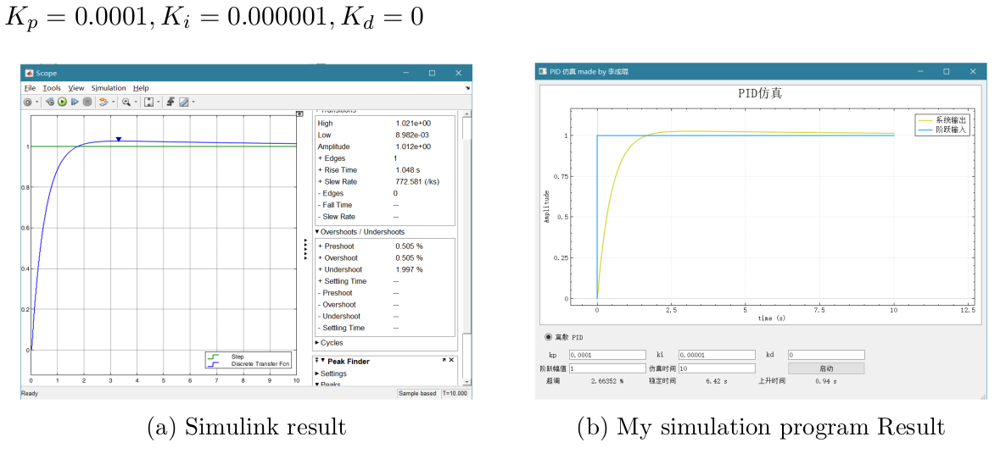
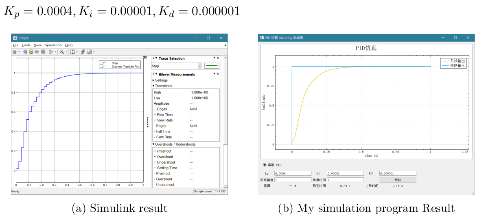
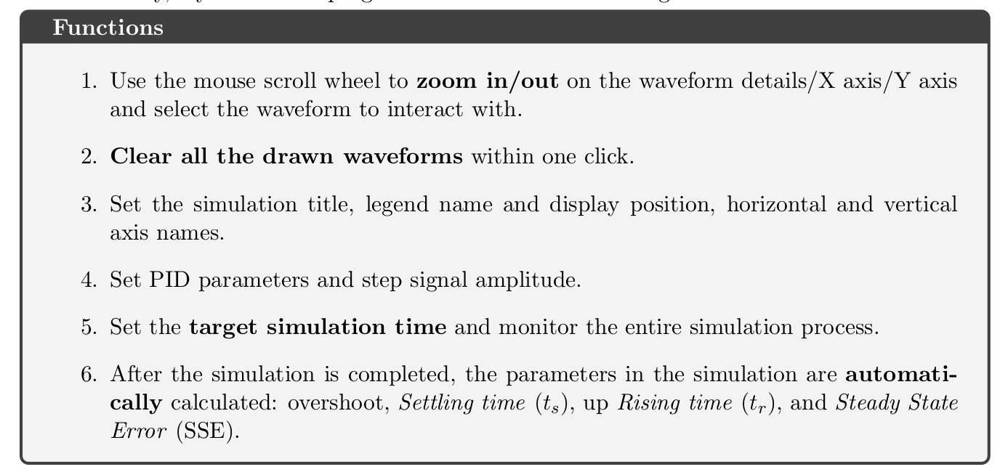

### Video Introduction

The video introduction has been uploaded to https://www.bilibili.com/video/BV1dC4y187oE
and https://www.bilibili.com/video/BV1ep4y1U7ME.

### System Diagram




### Comparing with Simulink





### Basic functions



### Dependencies

1. Qt
2. QCustomplot


### Usage

```bash
git clone https://github.com/CharlieLeee/PID-Simulation
cd build
qmake ../pid_control.pro && make
./PID-sim
```

